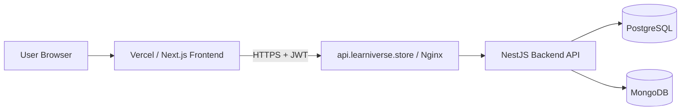

# Learniverse Client

## 프로젝트 소개

학생과 튜터가 강의 수강부터 과제 제출/피드백까지 한 흐름으로 진행하는 부트캠프형 학습 플랫폼

### 배포 URL
- 프론트엔드: `https://learniverse-client-alpha.vercel.app`
- 백엔드 API: `https://api.learniverse.store/api/v1`

---

## ② 기술 스택

### 사용 기술과 버전

#### Frontend (this repository)
| 영역 | 기술 |
|---|---|
| Framework | Next.js `16.1.6`, React `19.2.3`, TypeScript `5` |
| UI | Tailwind CSS `4`, shadcn/ui, Lucide React |
| State/Data | TanStack Query `5.90.21`, Zustand `5.0.11` |
| Form/Validation | react-hook-form `7.71.2`, Zod `4.3.6` |
| Test | Vitest `4.0.18`, Testing Library, Playwright `1.58.2` |

---

## ③ 주요 기능

### 핵심 기능 목록
- 회원가입/로그인/로그아웃 (학생/튜터 역할 기반)
- 강의 탐색, 강의 상세 조회
- 학생 수강 신청 및 내 학습(진도율) 대시보드
- 튜터 강의 생성/관리, 레슨 관리
- 튜터 과제 출제, 학생 과제 제출, 튜터 피드백
- 인증/권한 기반 라우트 보호 및 리다이렉트

---

## ④ 시스템 아키텍처

### 전체 구조도



### 배포 환경 설명
| 구성요소 | 환경 | 설명 |
|---|---|---|
| Frontend | Vercel | Next.js 정적/서버 렌더링 앱 배포 |
| 연결 방식 | `NEXT_PUBLIC_API_URL` | 프론트에서 백엔드 API 엔드포인트를 환경변수로 주입 |

---

## 로컬 실행

```bash
bun install
cp .env.example .env.local
bun run dev
```

환경변수 예시:

```bash
NEXT_PUBLIC_API_URL=http://localhost:3000/api/v1
```

---

## 테스트

```bash
# Unit test
bun run test

# Coverage
bun run test:coverage

# E2E
bun run e2e
```
